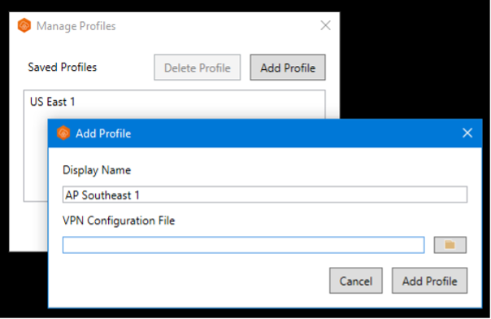

# AWS Cloud Reference Architecture - Automation

Automation to provision the Quick Start reference architecture on AWS Cloud. This architecture implements the minimum infrastructure required to stand up a managed Red Hat OpenShift cluster with public endpoints.

## Reference Architecture


The automation is delivered in a number of layers that are applied in order. Layer `110` provisions the infrastructure including the Red Hat OpenShift cluster and the remaining layers provide configuration inside the cluster. Each layer depends on resources provided in the layer before it (e.g. `200` depends on `110`). Where two layers have the same numbers (e.g. `205`), you have a choice of which layer to apply.

<table>
<thead>
<tr>
<th>Layer name</th>
<th>Layer description</th>
<th>Provided resources</th>
</tr>
</thead>
<tbody>
<tr>
<td>110 - AWS VPC OpenShift</td>
<td>This layer provisions the bulk of the AWS Cloud infrastructure</td>
<td>
<h4>Network</h4>
<ul>
<li>VPC network</li>
<li>VPC Subnet</li>
<li>VPC Public Gateways</li>
<li>Red Hat OpenShift cluster</li>
</ul>
<ul>
</ul>
</td>
</tr>
<tr>
<td>200 -  AWS OpenShift Gitops </td>
<td>This layer provisions OpenShift CI/CD tools into the cluster, a GitOps repository, and bootstraps the repository to the OpenShift Gitops instance.</td>
<td>
<h4>Software (TBD)</h4>
<ul>
<li>OpenShift GitOps (ArgoCD)</li>
<li>OpenShift Pipelines (Tekton)</li>
<li>Sealed Secrets (Kubeseal)</li>
<li>GitOps repo</li>
</ul>
</td>
</tr>
<tr>
<td>210 - AWS Storage</td>
<td>The storage layer offers `portworx`.
</td>
<td>
<ul>    
</ul>
<h4>Portworx Storage</h4>
<ul>
<li>AWS Cloud storage volumes</li>
<li>Portworx operator</li>
<li>Portworx storage classes</li>
</ul>
</td>
</tr>
<tr>
<td>220 - Dev Tools</td>
<td>The dev tools layer installs standard continuous integration (CI) pipelines that integrate with tools that support the software development lifecycle.</td>
<td>
<h4>Software</h4>
<ul>
<li>Artifactory</li>
<li>Developer Dashboard</li>
<li>Pact Broker</li>
<li>Sonarqube</li>
<li>Tekton Resources</li>
</ul>
</td>
</tr>
</tbody>
</table>

## Automation

### Prerequisites

1. Have access to an AWS Cloud Account. An Enterprise account is best for workload isolation but this terraform can be run in a Pay Go account as well.

2. (Optional) Install and start Colima to run the terraform tools in a local bootstrapped container image.

    ```shell
    brew install docker colima
    colima start
    ```

### Setup

1. Clone this repository to your local SRE laptop or into a secure terminal. Open a shell into the cloned directory.
2. Copy **credentials.template** to **credentials.properties**.
    ```shell
    cp credentials.template credentials.properties
    ```
3. Provide values for the variables in **credentials.properties**  (**Note:** `*.properties` has been added to **.gitignore** to ensure that the file containing the apikey cannot be checked into Git. Do not use quotes around the values in properties file )
    - **TF_VAR_aws_access_key_id** - The API key for the AWS Cloud account where the infrastructure will be provisioned.
    - **TF_VAR_aws_secret_access_key** - The API key for the AWS Cloud account where the infrastructure will be provisioned.
    - **AWS_ACCESS_KEY_ID=** - The API key for the AWS Cloud account where the infrastructure will be provisioned.
    - **AWS_SECRET_ACCESS_KEY** - The API key for the AWS Cloud account where the infrastructure will be provisioned.
    - **TF_VAR_rosa_token** - The offline rosa token used to provision  ROSA cluster
    - **TF_VAR_gitops_repo_username** - The username on github.com that will be used to provision the gitops repository.
    - **TF_VAR_gitops_repo_token** - The personal access token that will be used to authenticate to github.com to provision the gitops repository. (The user should have necessary access in the org to create the repository and the token should have `delete_repo` permission.)
    - **TF_VAR_gitops_repo_org** - (Optional) The github.com org where the gitops repository will be provisioned. If not provided the org will default to the username. 
    - **TF_VAR_portworx_spec** - (Optional) ([Create Portworx Storage Spec] (https://central.portworx.com/dashboard)).Kindly refer to following page for ([Portworx Storage Spec creation procedure] (https://github.com/cloud-native-toolkit/terraform-aws-portworx/blob/main/PORTWORX_ESSENTIALS.md)).

4. Run **./launch.sh**. This will start a container image with the prompt opened in the `/terraform` directory, pointed to the repo directory.
5. Create a working copy of the terraform by running **./setup-workspace.sh**. The script makes a copy of the terraform in `/workspaces/current` and set up a "terraform.tfvars" file populated with default values. The **setup-workspace.sh** script has a number of optional arguments.

    ```
    Usage: setup-workspace.sh [-f FLAVOR] [-s STORAGE] [-r REGION] [-n PREFIX_NAME] 

    
    where:
      - **FLAVOR** - Deployment architecture flavor to user. Possible options are `quickstart`, `standard` or `advanced` 
      - **STORAGE** - The storage provider. Possible options are `portworx` or `odf`. If not provided as an argument, a prompt will be shown.
      - **REGION** - The AWS Cloud region where the infrastructure will be provided ([available regions] (https://docs.aws.amazon.com/AWSEC2/latest/UserGuide/using-regions-availability-zones.html)). Codes for each location can be obtained from the CLI from shell - "aws ec2 describe-regions --output table". If this value is not provided then the value defaults to us-west-1
      - **PREFIX_NAME** - the name prefix that should be added to all the resources. If not provided a prefix will not be added.      

    ```
6. Change the directory to the current workspace where the automation was configured (e.g. `/workspaces/current`).
7. Inspect **terraform.tfvars** to see if there are any variables that should be changed. (The **setup-workspace.sh** script has generated **terraform.tfvars** with default values and can be used without updates, if desired.)

   **Note:** A soft link has been created to the **terraform.tfvars** in each of the terraform subdirectories so the configuration is shared between all of them.

#### Run the terraform layers

Note : Standard architecture ROSA  setup will have ONLY private end point exposed hence SRE desktop from where this installation procedure is perfomed must have VPN Connectivity with AWS environment before executing Modules - Gitops['200'], Portworkx ['210'] or Dev-tools ['220']

7.1 Setup ROSA Infrastructure with Private end point

Switch to **/workspaces/current/110-aws-std-openshift-vpc** directory, run the following:

```
terragrunt init
terragrunt apply -auto-approve
```

The script will run through each of the terraform layers in sequence to provision the ROSA and dependent infrastructure. Once the above setup is completed successfully proceed to next step.

7.2 Setup VPN Client in your local SRE laptop or from the laptop/server you want to connect to ROSA Infrastructure for executing modules '200', '210' or '220'

Step-1 : Download the Client VPN endpoint configuration file from AWS Console

Open the Amazon VPC ([console] (https://console.aws.amazon.com/vpc/)) 

Under 'VPC' Navigation Panel go to "Virtual Private Network (VPN)" menu item choose "Client VPN endpoints"


Select "Download Client Configuration" from this page and you will get a OpenVPN Client file name "downloaded-client-config.ovpn" downloaded to your local machine.


Step - 2 : Identify VPN Client Certificate and Client Key files from following folder where '110'' Module script was executed.

Client Certificate : /workspaces/current/110-aws-std-openshift-vpc/certificates/issued/client.x.y.z.crt
Client Key : /workspaces/current/110-aws-std-openshift-vpc/certificates/private/client.x.y.z.key

Step - 3 : Update "downloaded-client-config.ovpn" with VPN Client certificate and Client key and save this file.


Step - 4 : Install Open ([VPN Client] (https://aws.amazon.com/vpn/client-vpn-download/))

Step - 5 : Open AWS VPN Client App

step - 6 : Configure OpenVPN client profile to use OVPN file which was created part of Step - 3


Add Profile



Display Name, enter a name for the profile
VPN Configuration File, browse to and then select the configuration file which was created part of Step - 3. 
Choose Add Profile

Step - 7 : In the AWS VPN Client window, ensure that your profile is selected, and then choose Connect. 

Step - 8 : To view statistics for your connection, choose Connection, Show Details.


To Validate the connection, from the browser try accessing ROSA console URL which was printed at the end of Module '110' execution completion. Now, A Openshift login window should appear.

Now you have successfully established the connectivity lets proceed with setting up Giops, Porworx & Devtools module.

8. Setting up Gitops server on ROSA cluster

Switch to **/workspaces/current/200-aws-openshift-gitops** directory, run the following:

```
terragrunt init
terragrunt apply -auto-approve
```

9. Setting up Portworx storage on ROSA cluster

Switch to **/workspaces/current/210-aws-portworx-storage** directory, run the following:

```
terragrunt init
terragrunt apply -auto-approve
```

10. Setting up dev tools  on ROSA cluster

Switch to **/workspaces/current/220-dev-tools** directory, run the following:

```
terragrunt init
terragrunt apply -auto-approve
```

Now your standrd architecture environment is ready with ROSA Clutser configured with Portwork Storage, Gitops server and Development tools.