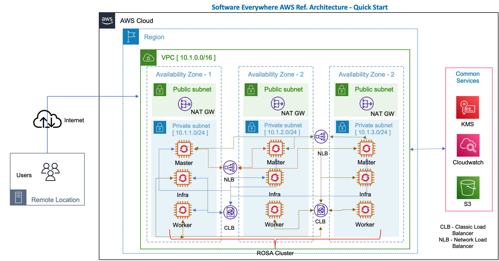

# AWS Cloud Reference Architecture - Infrastructure Automation

Created with the ***TechZone Accelerator Toolkit***

> This collection of AWS Cloud terraform automation bundles has been crafted from a set of [Terraform modules](https://modules.cloudnativetoolkit.dev/) created by Ecosystem Engineering

Three different flavors of the reference architecture are provided with different levels of complexity.

- QuickStart - minimum to get OpenShift with public endpoints running on basic VPC + Subnet with ROSA
- Standard - a simple robust architecture that can support a production workload in a single VPC with a VPN+Private Endpoints and a ROSA cluster
- Advanced - a sophisticated architecture isolating DMZs, Development and Production VPCs for best practices

## Reference architectures

This set of automation packages was generated using the open-source [`isacable`](https://github.com/cloud-native-toolkit/iascable) tool. This tool enables a [Bill of Material yaml](https://github.com/cloud-native-toolkit/automation-solutions/tree/main/boms) file to describe your AWS Cloud architecture, which it then generates the terraform modules into a package of infrastructure as code that you can use to accelerate the configuration of your AWS Cloud environment. Iascable generates standard terraform templates that can be executed from any terraform environment.

> The `iascable` tool is targeted for use by advanced SRE developers. It requires deep knowledge of how the modules plug together into a customized architecture. This repository is a fully tested output from that tool. This makes it ready to consume for projects.

### Quick Start



### Standard


## Automation

### Prerequisites

1. Have access to an AWS Cloud Account. An Enterprise account is best for workload isolation but this terraform can be run in a Pay Go account as well.

2. At this time the most reliable way of running this automation is with Terraform in your local machine either through a bootstrapped docker image or Virtual Machine. We provide both a [container image](https://github.com/cloud-native-toolkit/image-cli-tools) and a virtual machine [cloud-init](https://github.com/cloud-native-toolkit/sre-utilities/blob/main/cloud-init/cli-tools.yaml) script that have all the common SRE tools installed.

We recommend using Docker Desktop when using  the container image method, and Multipass if choosing the virtual machine method.   Detailed instructions for downloading and configuring both Docker Desktop and Multipass can be found in [RUNTIMES.md](./RUNTIMES.md)

### Planning

1. Determine which flavor of reference architecture you will provision: Quick Start, Standard, or Advanced.
2. View the README in the automation directory for detailed instructions for installation steps and required information:
    - [Quick Start](1-quickstart)
    - [Standard](2-standard)
    - [Advanced](3-advanced)

### Setup

1. Clone this repository to your local SRE laptop or into a secure terminal. Open a shell into the cloned directory.
2. Copy **credentials.template** to **credentials.properties**.
    ```shell
    cp credentials.template credentials.properties
    ```
3. Provide values for the variables in **credentials.properties** (**Note:** `*.properties` has been added to **.gitignore** to ensure that the file containing the apikey cannot be checked into Git.)

    - **TF_VAR_access_key** - The API key for the AWS Cloud account where the infrastructure will be provisioned.
    - **TF_VAR_secret_key** - The API key for the AWS Cloud account where the infrastructure will be provisioned.
    - **AWS_ACCESS_KEY_ID=** - The API key for the AWS Cloud account where the infrastructure will be provisioned.
    - **AWS_SECRET_ACCESS_KEY** - The API key for the AWS Cloud account where the infrastructure will be provisioned.
    - **TF_VAR_rosa_token** - The offline rosa token used to provision  ROSA cluster
        ```
        Users can download ROSA token from [RHN Link](https://cloud.redhat.com/openshift/token/rosa) using RHN Login credentails.
        ```

    - **TF_VAR_gitops_repo_username** - The username on git server host that will be used to provision and access the gitops repository. If the `gitops_repo_host` is blank this value will be ignored and the Gitea credentials will be used.
    - **TF_VAR_gitops_repo_token** - The personal access token that will be used to authenticate to the git server to provision and access the gitops repository. (The user should have necessary access in the org to create the repository and the token should have `delete_repo` permission.) If the host is blank this value will be ignored and the Gitea credentials will be used.
    - **TF_VAR_gitops_repo_org** - (Optional) The organization/owner/group on the git server where the gitops repository will be provisioned/found. If not provided the org will default to the username.
    - **TF_VAR_gitops_repo_project** - (Optional) The project on the Azure DevOps server where the gitops repository will be provisioned/found. This value is only required for repositories on Azure DevOps.

4. Run **./launch.sh**. This will start a container image with the prompt opened in the `/terraform` directory, pointed to the repo directory.
5. Create a working copy of the terraform by running **./setup-workspace.sh**. The script makes a copy of the terraform in `/workspaces/current` and set up a "terraform.tfvars" file populated with default values. The **setup-workspace.sh** script has a number of optional arguments.

    ```
    Usage: setup-workspace.sh [-f FLAVOR] [-s STORAGE] [-r REGION] [-n PREFIX_NAME] [-b BANNER_TEXT] [-g GIT_HOST] [-h HELP]
    
    where:
    - **FLAVOR** - the type of deployment `quickstart`, `standard` or `advanced`. If not provided, will default to quickstart.
    - **STORAGE** - The storage provider. Possible option is `portworx`. If not provided as an argument, a prompt will be shown.
    - **REGION** - the AWS Cloud region where the infrastructure will be provided [available regions](https://docs.aws.amazon.com/AWSEC2/latest/UserGuide/using-regions-availability-zones.html) . Codes for each location can be obtained from the CLI from shell - "aws ec2 describe-regions --output table". If this value is not provided then the value defaults to ap-south-1  (Note : User should always chose a AWS Region with minimum 3 AZs)
    - **PREFIX_NAME** - the name prefix that should be added to all the resources. If not provided a prefix will not be added.
    - **BANNER_TEXT** - the banner text that should be shown at the top of the ROSA cluster.
    - **GIT_HOST**  -  the git host that will be used for the gitops repo. If left blank gitea will be used by default. (Github, Github Enterprise,   Gitlab, Bitbucket, Azure DevOps, and Gitea servers are supported).
    - **HELP** - Print this help.
    ```
6. Change the directory to the current workspace where the automation was configured (e.g. `/workspaces/current`).
7.  Two different configuration files have been created: **cluster.tfvars** and **gitops.tfvars**. **cluster.tfvars** contains the variables specific to the infrastructure and cluster that will be provisioned. **gitops.tfvars** contains the variables that define the gitops configuration. Inspect both of these files to see if there are any variables that should be changed. (The **setup-workspace.sh** script has generated these two files with default values and can be used without updates, if desired.). E.g. cluster_ocp_version="4.9.15" can be changed to latest version cluster_ocp_version="4.10.01"


#### Run the entire automation stack automatically

From the **/workspace/current** directory, run the following:

```shell
./apply-all.sh
```

The script will run through each of the terraform layers in sequence to provision the entire infrastructure.

#### Run each of the Terraform layers manually

From the **/workspace/current** directory, change the directory into each of the layer subdirectories, in order, and run the following:

```shell
./apply.sh
```
